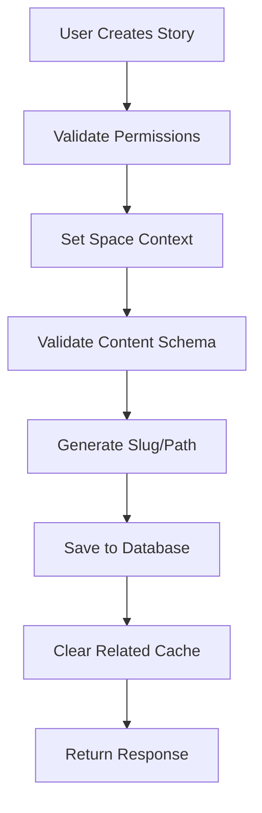
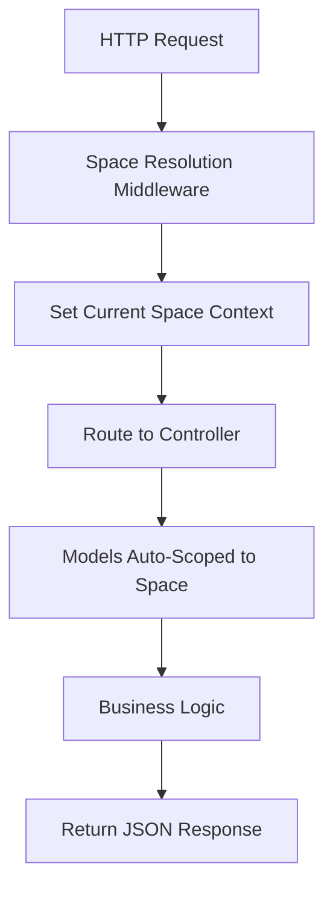

# Architecture Documentation

This document provides a detailed technical overview of the headless CMS architecture, designed to help developers understand the system's design principles and implementation details.

## 🏗️ System Overview

The headless CMS is built on Laravel 11.x with a focus on:

- **Multi-tenancy**: Complete data isolation between spaces (tenants)
- **Component-based content**: Storyblok-style content management
- **Modern PHP**: PHP 8.3+ with strict typing and advanced features
- **Performance**: Redis caching, PostgreSQL with JSONB, and optimized queries
- **Developer Experience**: Comprehensive traits, detailed documentation, and type safety

## 📊 Database Architecture

### Core Tables

```sql
-- Multi-tenant isolation
spaces (id, uuid, name, slug, settings, environments, languages, plan, status, ...)

-- User management with multi-tenant support  
users (id, uuid, name, email, preferences, metadata, status, timezone, language, ...)
roles (id, name, slug, permissions, is_system_role, priority, ...)
space_user (space_id, user_id, role_id, custom_permissions, ...)

-- Content management (Storyblok-style)
components (id, space_id, uuid, name, technical_name, schema, preview_field, status, ...)
stories (id, space_id, uuid, name, slug, content, parent_id, language, status, ...)

-- Asset management
assets (id, space_id, uuid, filename, content_type, file_size, storage_path, variants, ...)

-- External data integration
datasources (id, space_id, uuid, name, type, config, schema, auth_config, ...)
datasource_entries (id, datasource_id, uuid, name, data, dimensions, status, ...)
```

### JSONB Usage

The system extensively uses PostgreSQL's JSONB columns with GIN indexes for:

```sql
-- Component schemas with field definitions
components.schema -> GIN index for fast schema queries

-- Story content with component data  
stories.content -> GIN index for content searches

-- Asset variants and processing data
assets.variants, assets.processing_data -> GIN indexes

-- User preferences and space settings
users.preferences, spaces.settings -> GIN indexes

-- Datasource configuration and data
datasources.config, datasource_entries.data -> GIN indexes
```

## 🔧 Model Architecture

### Foundational Traits

#### HasUuid Trait
```php
// Provides UUID functionality for public API exposure
trait HasUuid
{
    // Auto-generates UUIDs on model creation
    // Enables route model binding by UUID
    // Provides findByUuid() helper methods
}

// Usage in models
class Story extends Model
{
    use HasUuid;
    
    // Routes: /api/stories/{story:uuid}
    // Queries: Story::findByUuid($uuid)
}
```

#### MultiTenant Trait
```php
// Automatic space-based scoping for data isolation
trait MultiTenant
{
    // Global scope: WHERE space_id = current_space_id
    // Auto-sets space_id on model creation
    // Provides space relationship and helper methods
}

// Usage
$currentSpace = app('current.space'); // Set by middleware
$stories = Story::all(); // Automatically scoped to current space
$story = Story::forSpace($otherSpace)->get(); // Override scoping
```

#### Sluggable Trait
```php
// URL-friendly slug generation with uniqueness
trait Sluggable
{
    // Auto-generates slugs from source field
    // Ensures uniqueness within scope
    // Handles updates and conflicts
}

// Configuration
protected string $slugSourceField = 'name';
protected bool $autoUpdateSlug = false; // Manual control
```

#### Cacheable Trait
```php
// Model-level caching with automatic invalidation
trait Cacheable
{
    // Cache model data with configurable TTL
    // Automatic cache invalidation on updates
    // Model-specific cache clearing
}

// Usage
$count = $space->getCached('stories_count', function () {
    return $this->stories()->count();
}, 3600); // Cache for 1 hour
```

### Model Relationships

#### Space (Tenant) Model
```php
class Space extends Model
{
    use HasUuid, Sluggable, Cacheable;
    
    // Multi-tenant relationships
    public function users(): BelongsToMany // via space_user pivot
    public function stories(): HasMany
    public function components(): HasMany  
    public function assets(): HasMany
    public function datasources(): HasMany
    
    // Business logic
    public function hasReachedStoryLimit(): bool
    public function supportsLanguage(string $lang): bool
    public function getEnvironmentConfig(string $env): array
}
```

#### Story (Content) Model
```php
class Story extends Model
{
    use HasUuid, MultiTenant, Sluggable, Cacheable;
    
    // Hierarchical content
    public function parent(): BelongsTo
    public function children(): HasMany
    
    // Multi-language support
    public function translatedStory(): BelongsTo
    public function translations(): HasMany
    
    // Content management
    public function getComponentsByType(string $type): array
    public function publish(?int $publishedBy = null): bool
    public function generateBreadcrumbs(): array
}
```

#### Component (Schema) Model
```php
class Component extends Model
{
    use HasUuid, MultiTenant, Sluggable, Cacheable;
    
    // Schema validation
    public function validateData(array $data): array
    public function getRequiredFields(): array
    public function getFieldsByType(string $type): array
    
    // Component management
    public function incrementVersion(): bool
    public function canBeUsedBy(?User $user): bool
}
```

## 🎨 Content Management System

### Component-Based Architecture

The CMS uses a Storyblok-inspired component system:

```php
// 1. Define component schema
$heroSchema = [
    [
        'key' => 'title',
        'type' => 'text',
        'required' => true,
        'max_length' => 100,
    ],
    [
        'key' => 'image',
        'type' => 'asset',
        'required' => false,
        'allowed_types' => ['image/jpeg', 'image/png'],
    ],
];

// 2. Create component
$component = Component::create([
    'name' => 'Hero Section',
    'technical_name' => 'hero_section',
    'schema' => $heroSchema,
    'is_root' => true,
]);

// 3. Use in story content
$storyContent = [
    'component' => 'page',
    'body' => [
        [
            '_uid' => Str::uuid(),
            'component' => 'hero_section',
            'title' => 'Welcome to Our Site',
            'image' => [
                'id' => 123,
                'filename' => 'hero.jpg',
                'alt' => 'Hero image',
            ],
        ],
    ],
];

// 4. Validate content against schema
$errors = $component->validateData($storyContent['body'][0]);
```

### Field Type System

Supported component field types:

```php
const FIELD_TYPES = [
    // Text fields
    'text', 'textarea', 'markdown', 'richtext',
    
    // Data types
    'number', 'boolean', 'date', 'datetime',
    
    // Selection
    'select', 'multiselect',
    
    // Media
    'image', 'file', 'asset',
    
    // Links and references
    'link', 'email', 'url', 'story',
    
    // Advanced
    'color', 'json', 'table', 'blocks',
];
```

### Content Validation

Real-time validation against component schemas:

```php
// Component validates data structure
public function validateData(array $data): array
{
    $errors = [];
    
    foreach ($this->schema as $field) {
        $key = $field['key'];
        $value = $data[$key] ?? null;
        
        // Required field validation
        if (($field['required'] ?? false) && empty($value)) {
            $errors[$key] = "Field '{$key}' is required";
            continue;
        }
        
        // Type-specific validation
        $error = $this->validateFieldValue($field, $value);
        if ($error) {
            $errors[$key] = $error;
        }
    }
    
    return $errors;
}
```

## 🔐 Multi-Tenant Security

### Automatic Scoping

All tenant-scoped models automatically filter by current space:

```php
// MultiTenant trait adds global scope
static::addGlobalScope('space', function (Builder $builder): void {
    $currentSpace = app('current.space');
    
    if ($currentSpace instanceof Space) {
        $builder->where('space_id', $currentSpace->id);
    }
});

// Queries are automatically scoped
Story::all(); // WHERE space_id = current_space_id
Asset::where('type', 'image')->get(); // WHERE space_id = X AND type = 'image'
```

### Role-Based Access Control

Hierarchical permission system:

```php
// Role hierarchy by priority
const PRIORITIES = [
    'admin' => 100,
    'editor' => 75, 
    'author' => 50,
    'viewer' => 25,
];

// Permission checking
public function hasPermissionInSpace(Space|int $space, string $permission): bool
{
    $role = $this->getRoleInSpace($space);
    $customPermissions = $this->getCustomPermissionsInSpace($space);
    
    // Custom permissions override role permissions
    if (isset($customPermissions[$permission])) {
        return (bool) $customPermissions[$permission];
    }
    
    return $role?->hasPermission($permission) ?? false;
}
```

## 🚀 Performance Optimizations

### Caching Strategy

Multi-level caching with automatic invalidation:

```php
// 1. Model-level caching
$space->getCached('stories_count', function () {
    return $this->stories()->count();
}, 3600);

// 2. Query result caching
Story::cacheQuery('published_stories', 
    Story::published()->latest(), 
    1800
);

// 3. Automatic cache invalidation
// Cache is cleared when models are updated
protected function clearModelSpecificCache(): void
{
    $this->forgetCache('stories_count');
    $this->forgetCache('assets_count');
}
```

### Database Optimizations

```sql
-- GIN indexes for JSONB queries
CREATE INDEX stories_content_gin_idx ON stories USING GIN (content);
CREATE INDEX components_schema_gin_idx ON components USING GIN (schema);

-- Composite indexes for common queries
CREATE INDEX stories_space_status_idx ON stories (space_id, status);
CREATE INDEX stories_space_language_idx ON stories (space_id, language);

-- Partial indexes for specific use cases
CREATE INDEX stories_published_idx ON stories (space_id, published_at) 
WHERE status = 'published';
```

### Query Optimization

```php
// Eager loading to prevent N+1 queries
$stories = Story::with(['space', 'creator', 'parent'])
    ->published()
    ->latest()
    ->get();

// Scoped queries with indexes
$publishedStories = Story::forSpace($space)
    ->published()
    ->whereNotNull('published_at')
    ->get();
```

## 🔄 Data Flow

### Content Creation Flow



### Multi-Tenant Request Flow



## 🧪 Testing Strategy

### Model Testing

```php
// Test multi-tenant isolation
public function test_stories_are_scoped_to_space(): void
{
    $space1 = Space::factory()->create();
    $space2 = Space::factory()->create();
    
    $story1 = Story::factory()->for($space1)->create();
    $story2 = Story::factory()->for($space2)->create();
    
    app()->instance('current.space', $space1);
    
    $this->assertCount(1, Story::all());
    $this->assertTrue(Story::all()->contains($story1));
    $this->assertFalse(Story::all()->contains($story2));
}

// Test component validation
public function test_component_validates_required_fields(): void
{
    $component = Component::factory()->create([
        'schema' => [
            ['key' => 'title', 'type' => 'text', 'required' => true],
        ],
    ]);
    
    $errors = $component->validateData(['title' => '']);
    
    $this->assertArrayHasKey('title', $errors);
    $this->assertStringContains('required', $errors['title']);
}
```

## 📈 Monitoring and Observability

### Performance Monitoring

```php
// Cache hit/miss tracking
public function getCached(string $key, callable $callback, ?int $ttl = null): mixed
{
    $cacheKey = $this->getCacheKey($key);
    
    if (Cache::has($cacheKey)) {
        event(new CacheHit($cacheKey));
        return Cache::get($cacheKey);
    }
    
    event(new CacheMiss($cacheKey));
    return Cache::remember($cacheKey, $ttl ?? $this->getCacheTtl(), $callback);
}
```

### Health Checks

```php
// Space health monitoring
public function getHealthStatus(): array
{
    return [
        'storage_usage' => $this->getStorageUsage(),
        'story_count' => $this->getStoriesCount(),
        'active_users' => $this->getActiveUsersCount(),
        'api_usage' => $this->getApiUsageStats(),
        'last_activity' => $this->users()->max('last_login_at'),
    ];
}
```

## 🔮 Extension Points

### Custom Field Types

```php
// Extend component field types
class CustomComponentSchema extends ComponentSchema
{
    protected function validateCustomField(mixed $value, array $field): ?string
    {
        // Custom validation logic
        return null;
    }
}
```

### Custom Caching Strategies

```php
// Implement custom cache drivers
class RedisModelCache implements CacheInterface
{
    public function remember(string $key, int $ttl, callable $callback): mixed
    {
        // Custom caching logic
    }
}
```

### Event System

```php
// Model events for extensibility
protected static function boot(): void
{
    parent::boot();
    
    static::created(function (Story $story) {
        event(new StoryCreated($story));
    });
    
    static::published(function (Story $story) {
        event(new StoryPublished($story));
    });
}
```

This architecture provides a solid foundation for a scalable, multi-tenant headless CMS while maintaining developer productivity and code quality.